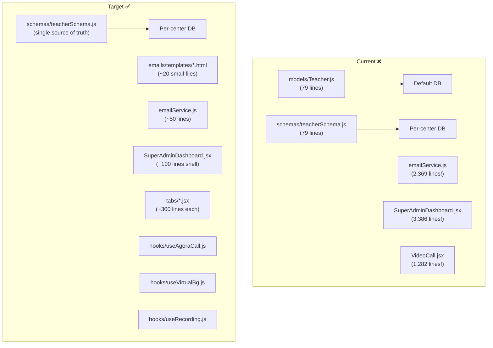

# 🏗️ Code Quality Audit — English Learning Platform

**Audited:** April 17, 2026  
**Scope:** Full-stack (44 server route files · 30 schemas · 19 utils · 80+ React components)

---

## Current Score: ~6/10 — Here's What You Need for 10/10

Your app has excellent feature depth and some genuinely strong patterns (centralized class completion, shared schemas, route versioning). The main issues are **structural**: duplicated code, oversized files, minimal test coverage, and inconsistent patterns. These are all fixable without rewriting — they just need disciplined refactoring.

---

## ✅ What You're Already Doing Right

| Area | Details |
|---|---|
| **Centralized business logic** | `classCompletionService.js` — single source of truth with optimistic locking, idempotency guard, and rollback. Excellent. |
| **Shared schemas** | `server/schemas/` dir allows models to be used across center DBs and super-admin — smart architecture. |
| **Route versioning** | `v1.js` aggregator with clear upgrade path to `v2`. |
| **API response helpers** | `apiResponse.js` — `ok()`, `badRequest()`, `notFound()` etc. for consistent response shape. |
| **Structured logging** | Custom `logger.js` with levels, file rotation, and auto-cleanup. |
| **Config validation** | `config.js` validates env vars at startup with actionable error messages. Strong. |
| **Lazy loading** | Frontend uses `React.lazy()` for all heavy pages. |
| **Error boundary** | App-level `ErrorBoundary` wrapping the entire React tree. |
| **DB indexing** | Schemas have targeted indexes (composite, sparse) for common query patterns. |
| **Branding system** | CSS custom properties + runtime theme injection — clean multi-tenant approach. |
| **No TODO/FIXME debt** | Zero `TODO`, `FIXME`, or `HACK` comments in the server codebase — unusual and impressive. |

---

## 🔴 CRITICAL — Structural Problems That Hurt Maintainability

### 1. Model vs. Schema Duplication — Two Sources of Truth

You have **both** `server/models/Teacher.js` **and** `server/schemas/teacherSchema.js` — and they've drifted apart.

**Models (registered directly):**

| File | Fields missing vs. Schema |
|---|---|
| [Teacher.js](file:///c:/Users/speak/OneDrive/Documents/English%20learning%20platform/server/models/Teacher.js) | Missing `phone`, `country`, `bio`, `yearsOfExperience`, `specializations`, `certifications`, `photo`, `displayName`, `bankName`, `accountNumber`, `accountName` |
| [Student.js](file:///c:/Users/speak/OneDrive/Documents/English%20learning%20platform/server/models/Student.js) | Missing `age` in schema, has `age` in model |
| [Admin.js](file:///c:/Users/speak/OneDrive/Documents/English%20learning%20platform/server/models/Admin.js) | Missing `pushSubscription`, no encryption getters |
| [Booking.js](file:///c:/Users/speak/OneDrive/Documents/English%20learning%20platform/server/models/Booking.js) | Drift risk — schema has more indexes |
| [ClassComplaint.js](file:///c:/Users/speak/OneDrive/Documents/English%20learning%20platform/server/models/ClassComplaint.js) (active file) | Uses `mongoose.model()` directly — only works for master DB, not per-center |

The `models/` files exist from before you built the multi-tenant `schemas/` architecture. Some routes import from `models/`, others from `schemas/`. This is a ticking time bomb — any field added to one but not the other silently breaks things.

**Fix:**
1. Delete all files in `server/models/` **except** `server/models/master/` (those are correctly single-DB)
2. All per-center models should come from `schemas/` only
3. Register models in routes via the pattern you already use: `db.models.Teacher || db.model("Teacher", teacherSchema)`
4. Add a lint rule or startup check that `models/*.js` never imports mongoose directly for tenant models

---

### 2. Mega-Files — Several Files Are Too Large to Maintain

| Severity | File | Lines | Problem |
|---|---|---|---|
| 🔴 | [emailService.js](file:///c:/Users/speak/OneDrive/Documents/English%20learning%20platform/server/utils/emailService.js) | **2,369** | 107KB of inline HTML templates mixed with business logic |
| 🔴 | [SuperAdminDashboard.jsx](file:///c:/Users/speak/OneDrive/Documents/English%20learning%20platform/src/pages/super-admin/SuperAdminDashboard.jsx) | **3,386** | 192KB — entire super admin UI in one component |
| 🔴 | [superAdminRoutes.js](file:///c:/Users/speak/OneDrive/Documents/English%20learning%20platform/server/routes/superAdminRoutes.js) | **1,147** | All super admin endpoints in one file |
| 🟠 | [VideoCall.jsx](file:///c:/Users/speak/OneDrive/Documents/English%20learning%20platform/src/pages/VideoCall.jsx) | **1,282** | Agora + MediaPipe + recording + chat + reactions — 5 features in one file |
| 🟠 | [SubAdminDashboard.jsx](file:///c:/Users/speak/OneDrive/Documents/English%20learning%20platform/src/pages/sub-admin/SubAdminDashboard.jsx) | **1,588** | Entire sub-admin UI in one component |
| 🟠 | [authRoutes.js](file:///c:/Users/speak/OneDrive/Documents/English%20learning%20platform/server/routes/authRoutes.js) | **798** | Could be split by role (admin/teacher/student) |

**Fix for emailService.js (biggest win):**
```
server/
  emails/
    templates/          ← HTML template files
      layout.html       ← shared wrapper (header, footer, styles)
      booking-request.html
      class-reminder.html
      deletion-warning.html
      ...
    emailService.js     ← thin sending layer (50 lines)
    templateEngine.js   ← reads template + fills variables (30 lines)
```

**Fix for dashboards:** Extract tab content into separate components:
```
pages/super-admin/
  SuperAdminDashboard.jsx            ← shell with tab router (100 lines)
  tabs/
    CentersTab.jsx
    PendingTab.jsx
    DomainsTab.jsx
    UsageTab.jsx
    AuditLogsTab.jsx
```

---

### 3. `sessionSchema` Defined 3 Separate Times (Copy-Paste)

The same `sessionSchema` (token, deviceInfo, ipAddress, loginTime, isActive) is defined identically in:
- [Admin.js:4-16](file:///c:/Users/speak/OneDrive/Documents/English%20learning%20platform/server/models/Admin.js#L4-L16)
- [Teacher.js:4-16](file:///c:/Users/speak/OneDrive/Documents/English%20learning%20platform/server/models/Teacher.js#L4-L16)
- [Student.js:4-12](file:///c:/Users/speak/OneDrive/Documents/English%20learning%20platform/server/models/Student.js#L4-L12)
- [teacherSchema.js:4-16](file:///c:/Users/speak/OneDrive/Documents/English%20learning%20platform/server/schemas/teacherSchema.js#L4-L16)
- [studentSchema.js](file:///c:/Users/speak/OneDrive/Documents/English%20learning%20platform/server/schemas/studentSchema.js) (likely)
- [adminSchema.js](file:///c:/Users/speak/OneDrive/Documents/English%20learning%20platform/server/schemas/adminSchema.js) (likely)

**Fix:** Extract to a shared file:
```js
// server/schemas/shared/sessionSchema.js
export const sessionSchema = new mongoose.Schema({
  token:        { type: String, required: true },
  deviceInfo:   { browser: String, os: String, device: String },
  ipAddress:    String,
  location:     String,
  loginTime:    { type: Date, default: Date.now },
  lastActivity: { type: Date, default: Date.now },
  isActive:     { type: Boolean, default: true },
});
```

Then import in every user schema: `import { sessionSchema } from './shared/sessionSchema.js';`

---

### 4. Dead Code in `main.jsx`

[main.jsx](file:///c:/Users/speak/OneDrive/Documents/English%20learning%20platform/src/main.jsx) has **28 lines of commented-out code** (lines 1–28) — two older versions of the app mount. This should be deleted.

```diff
-/*import React from 'react'
-import ReactDOM from 'react-dom/client'
-...13 more lines...
-)*/
-
-/*import React from "react";
-...14 more lines...
-);*/
-
 import React from 'react';
```

---

## 🟠 HIGH — Code Patterns That Should Be Fixed

### 5. `apiResponse.js` Exists But Almost No Route Uses It

You created a clean response helper (`ok()`, `badRequest()`, `notFound()` etc.) but almost every route still does:
```js
return res.status(400).json({ success: false, message: 'Invalid input' });
```

Instead of:
```js
return badRequest(res, 'Invalid input');
```

**This is ~800+ inline `res.status().json()` calls** that should use the helpers.

**Fix:** Migrate one route file at a time. Start with new routes using the helpers, then refactor existing ones.

---

### 6. Inconsistent Model Registration Pattern

Some routes use the safe lazy-registration pattern:
```js
// ✅ Good — safe for multi-tenant
const getTeacher = (db) => db.models.Teacher || db.model("Teacher", teacherSchema);
```

Other routes import pre-registered singleton models:
```js
// ❌ Bad — only works for the default connection
import Teacher from '../models/Teacher.js';
```

This causes subtle bugs: the singleton `Teacher` model always queries the **default** connection (master DB), not the per-center database.

**Fix:** Grep for all `import.*from.*'../models/(?!master/)` and replace with the schema-based pattern.

---

### 7. Inline Styles Everywhere in React Components

Almost all React components use `style={{...}}` objects instead of CSS classes:

```jsx
// App.jsx line 134-145
<nav style={{
  position: "fixed", top: 0, left: 0, right: 0, zIndex: 1000,
  background: "rgba(255,255,255,0.92)",
  backdropFilter: "blur(12px)",
  borderBottom: "1px solid rgba(0,0,0,0.07)",
  boxShadow: "0 2px 16px rgba(0,0,0,0.06)",
  height: "60px",
  display: "flex", alignItems: "center",
  padding: "0 20px", gap: "16px",
}}>
```

This makes styling unmaintainable, prevents theming, inflates bundle size (objects recreated every render), and blocks pseudo-selectors/media queries.

**Fix:** Move to CSS modules or a dedicated `.css` file per component. You already have Tailwind CSS in `devDependencies` — if you want to use it, commit to it across the app. If not, use vanilla CSS files with BEM naming.

---

### 8. No Frontend Test Coverage

You have:
- ✅ `server/tests/auth.test.js` (270 lines, covers login/verify/forgot-password)
- ❌ **Zero** frontend tests (no `*.test.jsx`, no `__tests__/` directory)
- ❌ **Only 1 test file** server-side — 43 routes untested

**For 10/10, minimum coverage target:**

| Layer | What to Test | Tool |
|---|---|---|
| Server routes | All CRUD operations, auth guards, edge cases | Vitest + supertest (extend existing setup) |
| Server services | `classCompletionService` edge cases, streak logic | Vitest unit tests |
| React components | Protected routes, login forms, booking flows | Vitest + React Testing Library |
| E2E critical paths | Login → Dashboard → Create Booking → Join Classroom | Playwright or Cypress |

---

### 9. `VideoCall.jsx` Has 5 Features in 1 File (1,282 Lines)

This component handles:
1. Agora video/audio (join, leave, publish, subscribe)
2. MediaPipe background blur
3. Tab recording + upload
4. Live chat via Socket.IO
5. Emoji reactions via Socket.IO

Each should be its own custom hook:

```
hooks/
  useAgoraCall.js       ← client, tracks, join/leave
  useVirtualBg.js       ← MediaPipe + Agora VB processors
  useRecording.js       ← start/stop/upload
  useVideoChat.js       ← socket messages
  useReactions.js       ← emoji socket events
```

Then VideoCall.jsx becomes a ~200 line layout component composing hooks.

---

### 10. Email Templates Are Inline HTML Strings (107KB!)

[emailService.js](file:///c:/Users/speak/OneDrive/Documents/English%20learning%20platform/server/utils/emailService.js) is **2,369 lines** because every email is a full HTML document written as a template literal. The same CSS styles (font-family, container, header gradient, footer) are **copy-pasted** in every function.

**Duplication example:** The date formatting logic appears in every email function:
```js
const formattedDate = new Date(date).toLocaleDateString("en-US", {
  weekday: "long", year: "numeric", month: "long", day: "numeric",
});
```

This exact block appears **15+ times**.

**Fix:**
1. Create a shared email layout with `{{slot}}` placeholders
2. Create a `formatDate()` utility (you likely already have `timezone.js`)
3. Move each email to its own template file or a simple template object
4. The service becomes: `readTemplate('booking-request') → fillSlots(data) → sendEmail()`

---

### 11. Frontend `ProtectedRoute` Logic Is Repeated 5 Times

You have 5 nearly identical protected route components:
- `AdminProtectedRoute.jsx`
- `SubAdminProtectedRoute.jsx`
- `SuperAdminProtectedRoute.jsx`
- `ProtectedRoute.jsx` (teacher)
- `StudentProtectedRoute.jsx`

Each does: check token → call verify endpoint → redirect if invalid.

**Fix:** Create one `AuthGuard.jsx` component with a `role` prop:
```jsx
<AuthGuard role="admin">  <AdminDashboard /></AuthGuard>
<AuthGuard role="teacher"><TeacherDashboard /></AuthGuard>
```

---

## 🟡 MEDIUM — Improve Before Scaling

### 12. No Type Safety — TypeScript Setup Exists But Unused

You have:
- `tsconfig.json` in both root and `server/`
- `typescript` in devDependencies
- `@types/react` and `@types/react-dom` installed
- An `apiResponse.ts` file alongside the `.js` version

But **zero** `.ts` or `.tsx` files in the actual application code. This is a half-started migration.

**Fix:** Either:
- **Commit to TypeScript** — rename files incrementally (`.js` → `.ts`), start with utils and models where types help most
- **Remove the TS setup** — delete `tsconfig.json` and TS deps to avoid confusion

---

### 13. Missing Error Boundaries for Individual Sections

You have one global `ErrorBoundary`, but a crash in any dashboard tab crashes the entire app. Add per-section error boundaries:

```jsx
<ErrorBoundary fallback={<TabErrorFallback />}>
  <ScheduleTab />
</ErrorBoundary>
```

---

### 14. Console Logging Instead of Structured Logger

The server has a proper `logger.js` but many files still use raw `console.log`:

```js
// superAdminRoutes.js
console.error('❌ Super admin login error:', err);

// dbManager.js  
console.log(`✅ DB connected: db_${centerSlug}`);
```

**Fix:** Replace all `console.*` calls in `server/` with `logger.info/error/warn`. The logger already handles file output, levels, and dev-only console coloring.

---

### 15. Frontend Has No Global State Management

Every dashboard component independently calls APIs and manages its own state. There's no shared state for:
- Current user profile
- Current center branding
- Notifications
- Active booking status

You have `BrandingContext` but it's minimal (772 bytes). Consider adding a lightweight state layer — even just React Context for auth state would prevent the pattern of reading `sessionStorage` in 15+ different components.

---

### 16. Mixed Naming Conventions

| Pattern | Examples | Problem |
|---|---|---|
| Student `surname` | `Student.surname` | Every other model uses `lastName` |
| `noOfClasses` | `Student.noOfClasses` | Abbreviation — should be `classCredits` or `remainingClasses` |
| Route naming | `/teacher-availability` vs. `/recurring-bookings` | Inconsistent plural/hyphenation |
| Frontend files | `ForgotPassword.jsx` exists in both `teacher/` and `student/` | Could be one shared component with a `role` prop |

---

### 17. `teacherLessonRoutes.js` Is Empty (0 Lines)

[teacherLessonRoutes.js](file:///c:/Users/speak/OneDrive/Documents/English%20learning%20platform/server/routes/teacherLessonRoutes.js) is an empty file that shouldn't exist. Delete it.

---

### 18. Two Route Files Mounted on Same Prefix

```js
// v1.js
router.use("/teachers",  teacherRoutes);           // line 52
router.use("/teachers",  teacherAssignmentRoutes);  // line 62 — SAME prefix!

router.use("/payments",  paymentRoutes);            // line 54
router.use("/payments",  paymentTransactionRoutes); // line 66 — SAME prefix!
```

This works in Express (routes merge) but it's confusing — you can't tell which file handles `GET /teachers/xyz` without checking both. Merge or rename.

---

## 🔵 LOW — Nice-to-Have

### 19. Add JSDoc to All Exported Functions

Your `emailService.js` has JSDoc on some functions but most server utils and all frontend components have none. At minimum, add `@param` and `@returns` to exported functions.

### 20. Add `package.json` Scripts for Common Tasks

```json
{
  "scripts": {
    "test": "vitest run",
    "test:watch": "vitest",
    "test:coverage": "vitest run --coverage",
    "lint": "eslint . && eslint server/ --config server/.eslintrc",
    "lint:fix": "eslint . --fix",
    "db:seed": "node server/scripts/seed.js"
  }
}
```

### 21. Add Prettier for Consistent Formatting

You have no `.prettierrc` at the root. Add one to enforce consistent formatting across the team:
```json
{
  "semi": true,
  "singleQuote": true,
  "trailingComma": "es5",
  "printWidth": 100,
  "tabWidth": 2
}
```

### 22. ESLint Config Only Covers Frontend

Your `eslint.config.js` uses `globals.browser` — the server code is not linted. Add a separate ESLint config for `server/` with `globals.node`.

---

## 📋 Priority Checklist

| # | Severity | Item | Effort | Impact |
|---|---|---|---|---|
| 1 | 🔴 Critical | Delete duplicate `models/` — use `schemas/` only | 2hr | Eliminates data drift bugs |
| 2 | 🔴 Critical | Split `emailService.js` into templates + sender | 4hr | -2,300 lines, makes emails maintainable |
| 3 | 🔴 Critical | Split `SuperAdminDashboard.jsx` into tab components | 3hr | Makes UI debuggable |
| 4 | 🔴 Critical | Extract shared `sessionSchema` | 30min | Fixes 6× copy-paste |
| 5 | 🟠 High | Extract `VideoCall.jsx` into custom hooks | 3hr | 1,282 → ~200 lines |
| 6 | 🟠 High | Use `apiResponse.js` helpers in all routes | 3hr | Consistent error responses |
| 7 | 🟠 High | Fix model import pattern (schemas not models) | 2hr | Fixes multi-tenant bugs |
| 8 | 🟠 High | Write server route tests (minimum auth + bookings + classroom) | 8hr | Catch regressions |
| 9 | 🟠 High | Remove inline styles → CSS classes | Ongoing | Performance + maintainability |
| 10 | 🟠 High | Consolidate 5 ProtectedRoute components into 1 | 1hr | -5 files, one pattern |
| 11 | 🟡 Medium | Delete dead code (`main.jsx` comments, empty route file) | 15min | Clean codebase |
| 12 | 🟡 Medium | Replace `console.*` with `logger.*` in server | 1hr | Structured prod logs |
| 13 | 🟡 Medium | Decide on TypeScript — commit or remove | 30min | Remove confusion |
| 14 | 🟡 Medium | Add per-section error boundaries | 1hr | Better crash isolation |
| 15 | 🟡 Medium | Fix naming inconsistencies (`surname` → `lastName`) | 2hr | Consistency |
| 16 | 🟡 Medium | Split overlapping route prefixes | 30min | Clearer route ownership |
| 17 | 🔵 Low | Add JSDoc to exported functions | Ongoing | Better IDE support |
| 18 | 🔵 Low | Add Prettier config | 15min | Consistent formatting |
| 19 | 🔵 Low | Add ESLint for server code | 30min | Catch server bugs |
| 20 | 🔵 Low | Global auth context for frontend | 2hr | Stop reading sessionStorage everywhere |

---

## Architecture Diagram — Current vs. Target



---

> [!IMPORTANT]
> The first 4 items (Critical) will have the highest impact on code quality. Fixing the model duplication alone prevents an entire class of multi-tenant bugs. Splitting the email service makes it possible for anyone to update an email without understanding 2,369 lines of code.

Want me to start implementing any of these? I'd recommend tackling item #4 (shared sessionSchema) and #11 (dead code cleanup) first since they're quick wins.
